# Machine Learning

Defintion: “Field of Study that gives computers the ability to learn without being explicitly programmed.” - Arthur Samuel (1959)

## Machine Learning algorithms

- Supervised Learning
  - used most in real world applications
  - course 1 and 2
- Unsupervised Learning
  - course 3
  - Recommender systems
  - Reinforcement learnings

## Supervised Learning Part 1

- learns from being given "right answers"
- email -> spam? -----> Spam filtering
- audio -> text transcript ----> speech recognition
- english -> spanish -----> machine translation
- ad, user info -> click ----> online advertising
- image, rador info -> position of other cars ---> self-driving car
- image of phone -> defect? ---> visual inspection

#### Regression learning

- Predict a number infinity many possible outputs

#### Classification learning

- Predict a number with limited amount of outputs or predict categories

## Unsupervised Learning Part 1

- Find something interesting in unlabeled data
- We don't give a right answer, instead ask the algorithms to figure it out by itself
- Clustering algorithm
  - Places the data in different clusters
  - For example, google news groups related stories together
  - Not using Supervised Learning since news is unpredictable. There isn't a right answer.

## Unsupervised Learning Part 2:

- Data only comes with inputs x, but output labels y
- Algorithm has to find structure in the data
- Clustering algorithm: Group similar data points together
- Anomaly detection: Find unusual data points
  - Used for fraud detection in the financial system, like in unusual transations could be signs of fraud.
- Dimensionality reduction:
  - Compress data using fewer numbers

## Cost Function Formula:

- Find a y value close to all points
- Cost Function Formula

  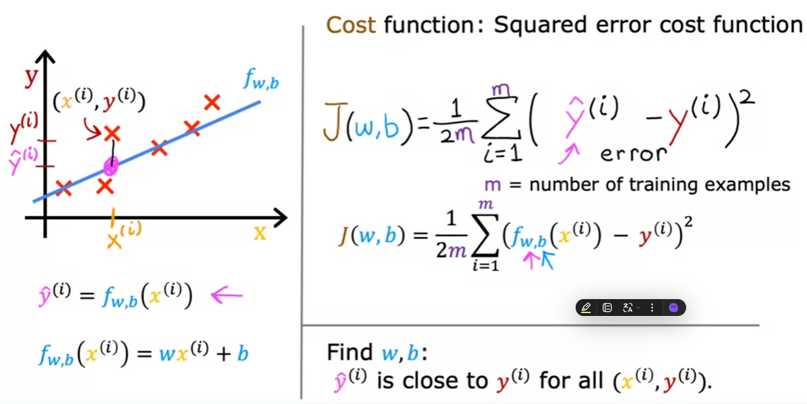

## Cost Function Intuition

- Simplied
- The cost function J(w,b) is like the measure of how bad the model's predictions are. If the line misses the actual data poinst by a lot, the cost is high.
- The goals is find the lowest w and b values that make the cost as low as possible.

  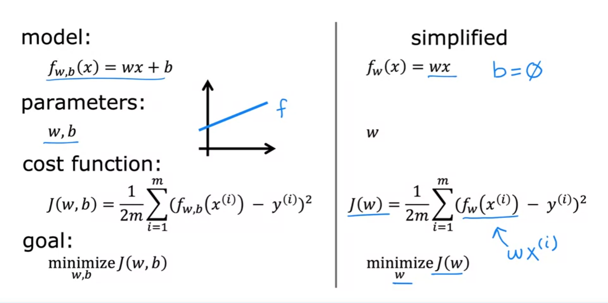

- J(1) = 0 means that there is no difference between the slope line and the points

  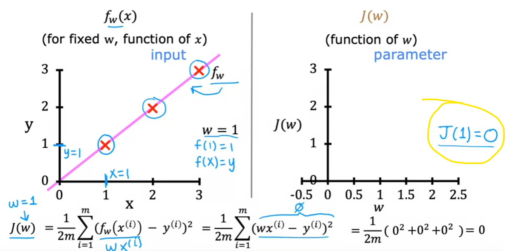

- When m = 0.5, it means that slope of the line is 0.5. In this example m = 0.5 gives 0.58. Which means that difference between the line and the points is 0.58.

  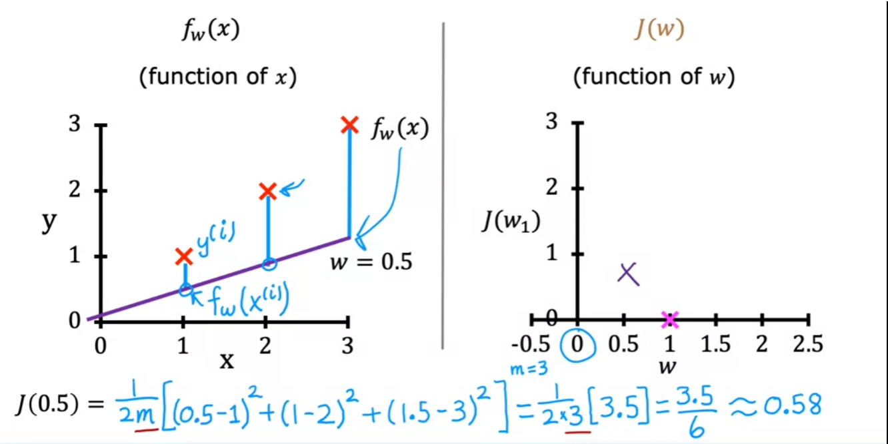

- The graph in the right is showing the rate of change between the line where m = 0.5 and the points.

  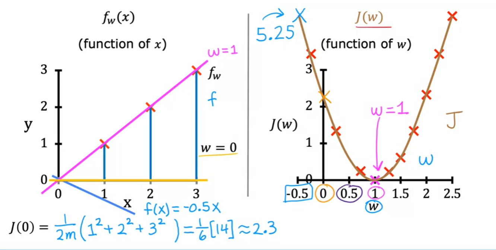

## Visualization Examples

- The slope line isn't a good fit for this training set.
- The fasther away the point is from the middle of the circle the farther the value is from the Dataset
- 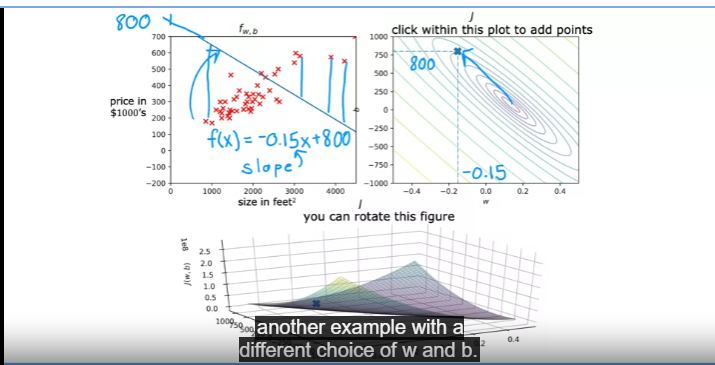

- This example still isn't the best but but it the line is closer to the data set than the previous example.
- It is proven in the circle point
  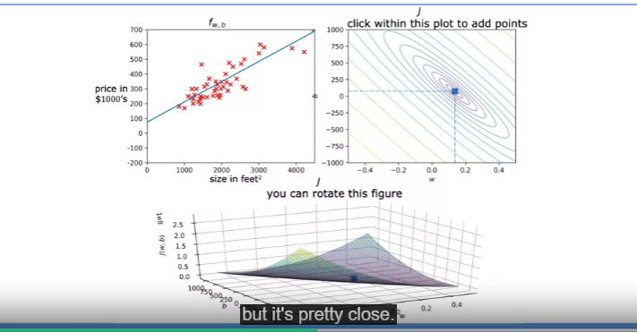
- This example shows a almost perfect line of best fit for the training set. 
- The point is close the center, and line relativly matched with the points around it.

## Gradient Descent
- The gradient descent algorithm helps find the small value of j of w, b
- Gradient descent is an algorithm for finding values of parameters w and b that minimize the cost function J. (Defintion)
  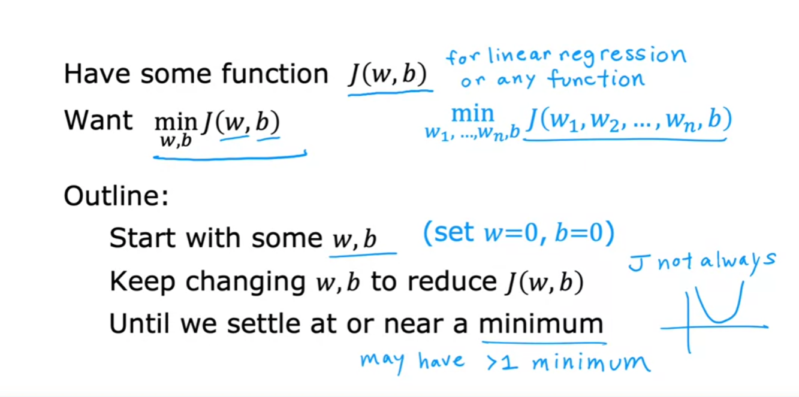
-  In this example, the for every small step the the guy takes, he will look around is find the next small step. He will continue like this until he found the minimum value. If the person were to start in the different position, a position more close to the other minimum value, then the minimum value is the local minimum value.
-  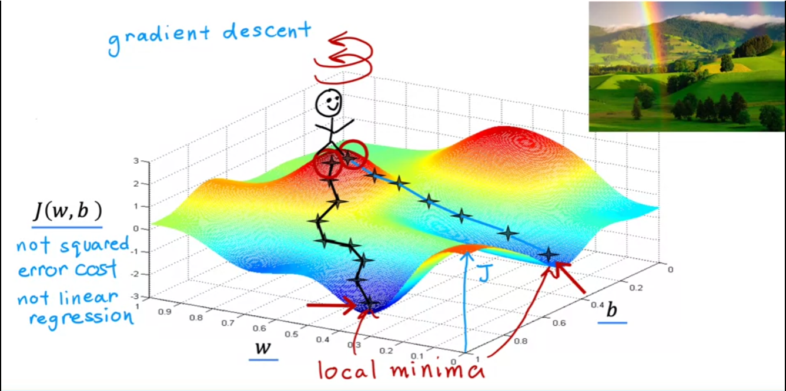

## Implementing gradient descent
- The gradient descent formula in code is 
- The goal of this algorithm is to repeat this algorithm until you have reached the point where the local minimum value "w" and "b" don't change much.
- "a" is the learning rate(always positive)
- 6/6w is the partial derivate
  

## Gradient Descent algorithm
- J(w) is the cost
- The derivative d/dw(J(w)) measures the rate of change of the cost function with respect to w.
- This derivate tells the slope of the cost function at any point in the w. Basically think of the tangent line. 
- [Learn Tangent Line](https://www.youtube.com/watch?v=5NyeGzbBJQM).
-  z
  
## Gradient Descent for linear regression
- If you do the derivative of Gradient Descent algorithm you get the cost function formula.
  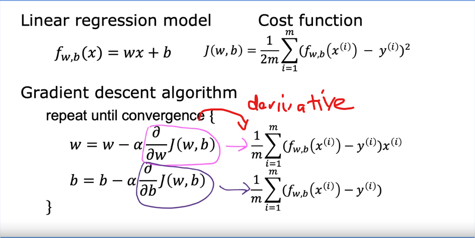
- The gradient descent algorithm has many local minimums. Depending on where you 
  intialize the parameters w and b you can end up in different locations.
  
- Squared error cost function has one global minimum.
  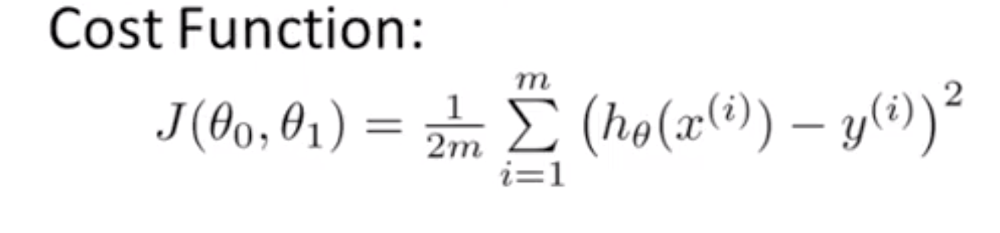

## Running Gradient Descent
- This is the base linear alebra line with no gradient descent formula
  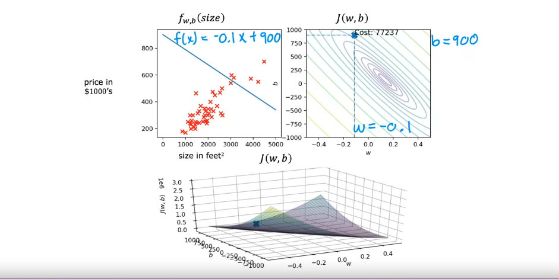